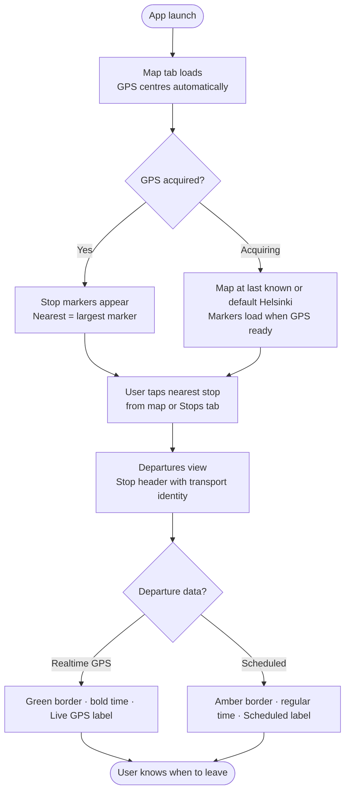
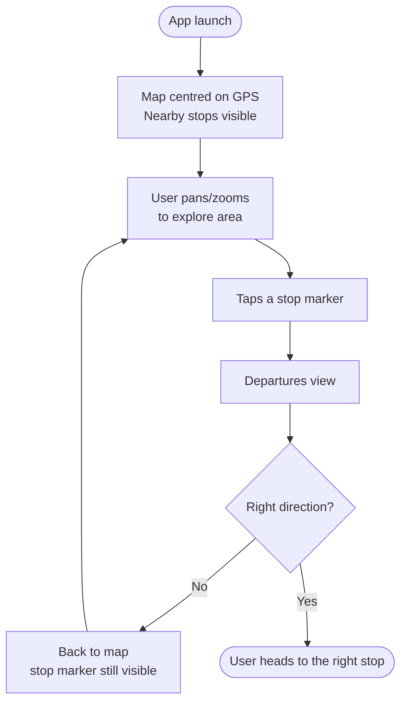
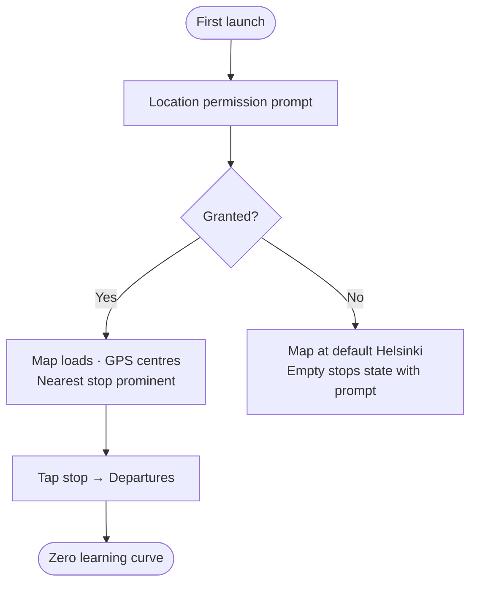
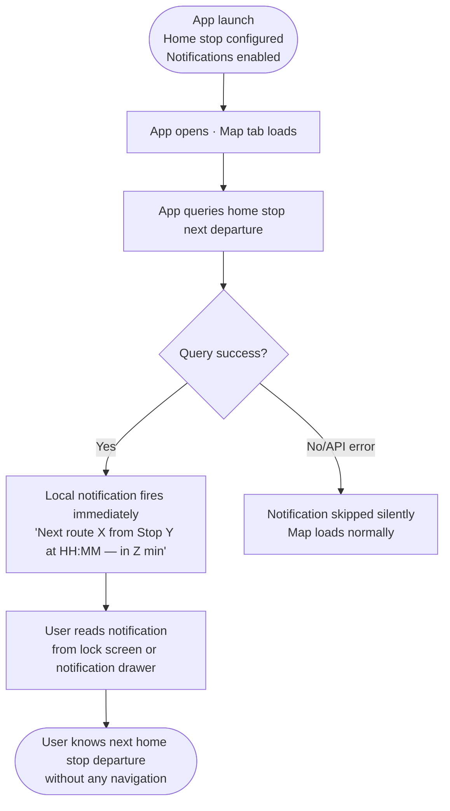
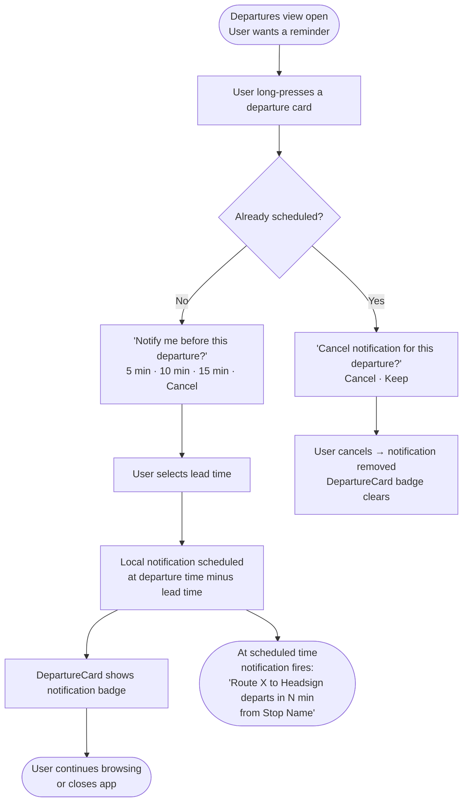
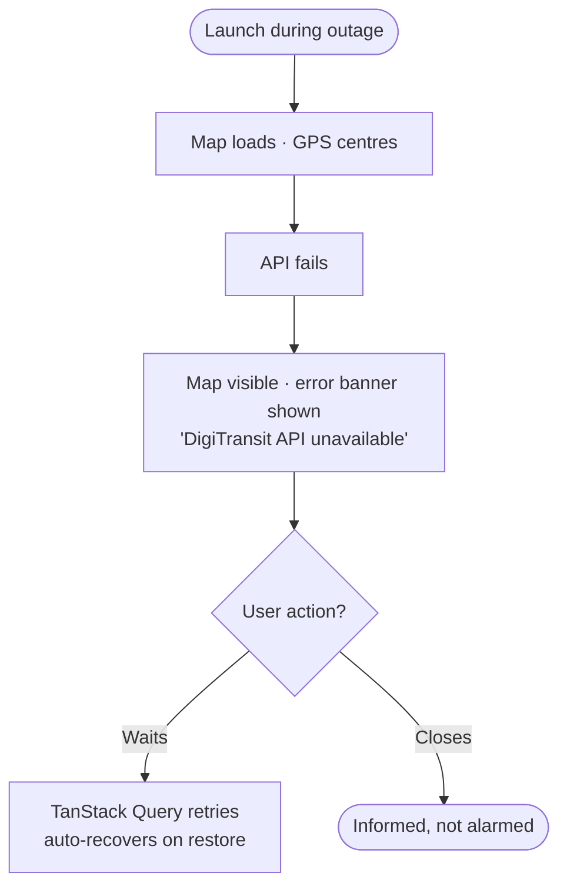
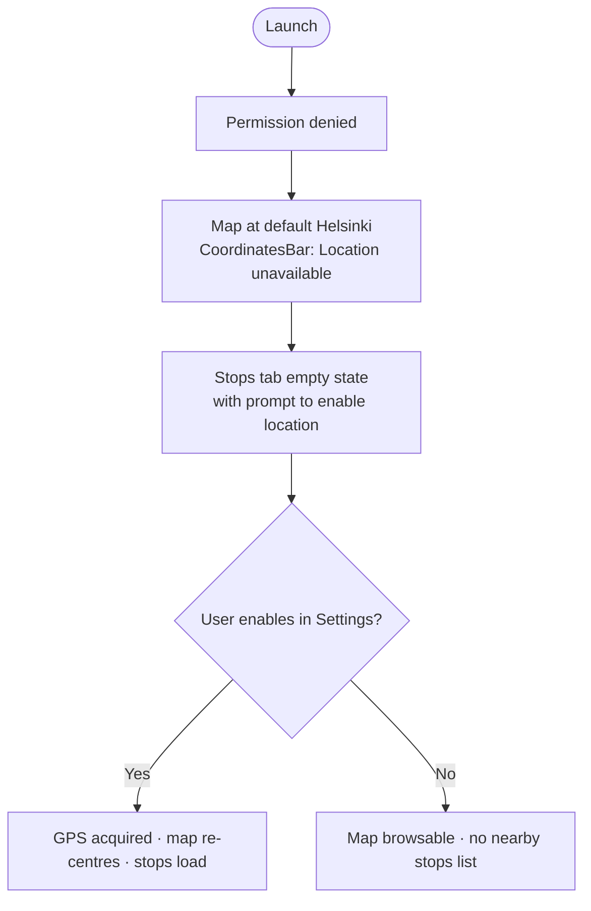

# UX Design Specification DigiTransit-v2

**Author:** Jyrki
**Date:** 2026-03-07

---

## Executive Summary

### Project Vision

DigiTransit v2 is a cross-platform (iOS, Android, web) public transit companion app — a ground-up rebuild of a proven Kotlin/Android personal project consuming the DigiTransit GraphQL API for Finnish public transport. Its defining purpose is a single, fast answer to a recurring question: *"When is the next departure from the stop nearest to me?"*

The app does not compete with official transit apps on breadth. It wins on speed of the core task: two taps from launch to departure times for the nearest stop. The four-tab structure (Map → Stops → Departures → Settings) reflects deliberate scope discipline — no route planning, no fare purchase, no alerts, no account management.

### Target Users

**Primary — The Daily Commuter (Jyrki):** A Helsinki software developer who uses public transport every weekday. Knows his route well, needs to know *exactly* when the next tram is coming before committing to leaving. Time pressure is real (jacket half-on, 3-minute window). Needs an answer in under 5 seconds with zero navigation overhead.

**Secondary — The Explorer:** Same user, unfamiliar area. Needs spatial context to choose the right stop among several options. A list alone is insufficient — the map gives him the "aha" of seeing where things are relative to each other.

**Edge case — The First-Timer (Mikko):** Friend who installs cold, already standing at a bus stop, zero onboarding patience. Expects the app to work immediately and correctly. If it does, he keeps it.

### Key Design Challenges

1. **Four-tab navigation with map as primary entry point.** v1 had no map and used a different tab order. The new leftmost map tab must feel immediately useful with no user action — GPS auto-centres on open, markers appear, the nearest stop is visually dominant. No loading void, no orientation confusion.

2. **Marker readability on the map.** Colour-coded by transport type + size by proximity, across iOS/Android/web, in direct sunlight. The visual hierarchy must make it immediately clear which stop to tap — without a legend, without labels cluttering the view.

3. **Speed of the critical path.** The entire value proposition is 2 taps, launch to departures. Any friction — slow map load, unclear tap targets, ambiguous back-navigation — directly undermines the product's reason to exist.

### Design Opportunities

1. **Map as spatial confidence builder.** Unlike the list-only v1, the map lets users orient themselves spatially before tapping anything. A well-designed map view makes the app *feel* smarter and more trustworthy than a list, even before any interaction.

2. **Departure card as trust signal.** The green/yellow realtime distinction is a powerful confidence signal. Done well — clear typography, purposeful colour, unambiguous iconography — it communicates "this is live data I can trust" at a glance.

3. **Modern dark aesthetic with purpose.** v1 used a functional but dated dark theme with purple/blue accents. v2 can evolve this into something that feels premium and intentional while preserving the low-cognitive-load darkness that works well outdoors at night and in transit contexts.

## Core User Experience

### Defining Experience

The product's entire value is a single interaction: tapping a stop and seeing departure times appear instantly. Everything else — the map, the stops list, the settings — exists only to serve or support that moment. The defining experience is not the map, not the list, not the notifications; it is the tap-to-departures transition. If that is fast and clear, the app succeeds. If it is slow or ambiguous, nothing else redeems it.

**Core user action:** Tap a stop → see departures immediately.
**Critical path:** Launch → map centred on user → tap nearest stop → departures visible. Two taps, under 5 seconds.

### Platform Strategy

Cross-platform (iOS, Android, web) via React Native + Expo. All platforms must support the full feature set except web push notifications (out of scope). Touch is the primary interaction model on mobile; web is a secondary target for accessibility without app installation.

The map is a first-class platform citizen — not a widget. It must load fast, render markers clearly, and respond to taps with no perceptible delay. Platform-specific map implementations (react-native-maps on native, Mapbox/Google Maps JS on web) are abstracted behind a shared interface so UX behaviour is consistent.

Offline mode is not supported by design — the app is API-dependent. Graceful degradation (map tiles without API data) is the offline story.

### Effortless Interactions

These interactions must require zero conscious thought:

- **Opening the app** → map is already centred on the user's location, stop markers visible, no action required
- **Identifying the nearest stop** → marker size communicates proximity without reading any text or distances
- **Reading departure times** → realtime vs. timetable-based is distinguishable in under one second by colour alone
- **Going back** → standard platform back navigation, no dead ends, no modals trapping the user
- **Auto-refresh** → stops and departures update silently in the background; user never manually refreshes

### Critical Success Moments

1. **First 2 seconds after launch** — map appears, user location dot is shown, stop markers are visible. Failure here means the app feels broken before the user has done anything.
2. **First tap on a stop marker** — departures appear quickly and clearly, with realtime/estimate distinction immediately readable. This is the moment the app earns or loses trust.
3. **First-timer cold start** — location permission granted → map loads → nearest stop is the obvious, correct one → tap → accurate departures. Zero onboarding. If this works, the app earns its place on the home screen.
4. **Error state encountered** — API down, GPS denied. The map must still render and the message must be clear and calm. Failure here (crash, spinner, blank screen) destroys confidence disproportionately to the frequency of occurrence.

### Experience Principles

1. **Speed is the feature.** Every design decision should reduce time-to-answer. If a visual element, animation, or interaction doesn't serve this, question its existence.
2. **The map does the work.** Proximity markers, colour coding, and GPS centring should make the answer obvious before the user consciously processes anything.
3. **Trust through clarity.** Realtime data must look different from estimates — not subtly, but unmistakably. The user's decision to catch a vehicle depends on this distinction.
4. **Dark, calm, focused.** The visual tone should feel like a tool, not an app. Low visual noise, high contrast where it matters, nothing competing for attention with the core data.

## Desired Emotional Response

### Primary Emotional Goals

**Primary: Confident calm.** Not excitement, not delight — those are the wrong register for a utility used under time pressure. The user standing at the door has no patience to be charmed. They want to feel *certain*: certain about when to leave, certain the data is live, certain the app is showing them the right stop. The app succeeds when users feel like they know exactly what's happening and exactly what to do next.

### Emotional Journey Mapping

| Stage | Desired feeling | What creates it |
|---|---|---|
| First launch | Relief — "this is simple" | Map loads fast, no onboarding clutter, location centres immediately |
| Tapping a stop | Anticipation → confirmation | Smooth transition, departure times appear quickly |
| Reading departures | Trust | Green realtime indicator is unmistakable; the time is large and readable |
| Task complete | Calm control | "I know when to leave." No lingering uncertainty. |
| Error state | Informed, not alarmed | Clear message, map still visible, no crash or blank screen |
| Return visits | Familiarity, efficiency | Nothing has moved, muscle memory works immediately |

### Micro-Emotions

- **Trust vs. Skepticism** — the realtime/estimate distinction is the make-or-break micro-emotion. If the user cannot tell whether a departure time is live GPS data or a timetable guess, they lose confidence in the entire app.
- **Confidence vs. Confusion** — the map's marker hierarchy must make the right stop obvious. Confusion at the map leads to the wrong tap, wrong departures, and distrust — even when the data was correct.
- **Efficiency vs. Frustration** — every extra tap, unnecessary animation, or blocking loading state is felt as friction disproportionately, because the user is already in a time-pressured state.

**Emotions to actively avoid:**
- Anxiety (slow loads, ambiguous states, unclear errors)
- Overwhelm (too many stops cluttering the map, too much information per departure card)
- Distrust (no clear distinction between realtime and estimated data)

### Design Implications

- **Trust** → departure cards use a strong, unambiguous visual treatment for realtime vs. estimate — not just a subtle colour difference, but reinforced by typography weight and iconography
- **Confident calm** → large, readable type; no padding animations; dark background reduces visual noise
- **Efficiency** → no loading spinners blocking content; skeleton states or cached data shown while refreshing; back navigation is always one tap
- **Informed on error** → error states use calm, factual language ("DigiTransit API unavailable") not alarming language; map remains visible as visual grounding

### Emotional Design Principles

1. **Certainty over delight.** When in doubt, choose clarity. A user who feels certain will return; a user who feels charmed but uncertain will not.
2. **Trust is earned at the departure card.** The realtime/estimate distinction is the highest-stakes emotional moment in the product. It must be impossible to misread.
3. **Calm is a design decision.** Visual noise, unnecessary motion, and information density all raise anxiety. Every element removed is emotional load reduced.
4. **Errors are informative, not alarming.** The user should always understand what happened and feel in control, even when the API is down.

## UX Pattern Analysis & Inspiration

### Inspiring Products Analysis

**1. Dark Sky (original) / Apple Weather — Primary visual reference**

The benchmark for "one fast answer from real-time data" on mobile. Its entire UX was built around a single question presented without clutter. The defining visual pattern: glassy cards floating over a live map background, with frosted glass (backdrop blur + semi-transparent dark surface), dark-gray gradient card surfaces suggesting physical depth, and data-first typography — large, readable numbers on a calm dark surface. The map is always present as a backdrop; cards feel like they are floating *above* it, not replacing it. The emotional register it creates — certain, informed, trusted — is exactly the target for DigiTransit v2.

**2. Flighty — Trust signal reference**

A flight tracking app that excels at making the distinction between live GPS data and scheduled/estimated data unmistakable. Status-driven colour use (not decorative — every colour means something specific), premium dark card aesthetic with subtle elevation, and typography weight reinforcing data status. Best-in-class reference for the realtime/estimate trust problem central to DigiTransit v2.

**3. Apple Maps (bottom sheet pattern) — Interaction/navigation reference**

The floating bottom sheet layered over the map — same "detached" feel as the target aesthetic. Scrollable card list that does not hide the map beneath it. Tap a marker → card expands, map remains visible behind. Clean back-navigation that returns the user to map context. The interaction model for how cards and map coexist.

### Transferable UX Patterns

**Visual / Surface patterns:**
- Frosted glass cards (backdrop blur + semi-transparent dark surface) floating over a blurred live map — adopted directly from Dark Sky
- Dark-gray gradient on card surfaces — not flat black, but a gradient suggesting physical depth (slightly lighter surface, darker edges)
- Subtle drop shadow + elevation on cards to reinforce the 3D / floating effect
- Transport-type colour as card tint and left accent — same glass material, tinted by type (bus=blue, tram=green, train=purple, metro=orange, ferry=teal)
- Glassy detached coordinate/address bar pinned to the top of all relevant views — same frosted glass treatment as cards but styled as a persistent HUD strip
- Frosted glass tab bar — map bleeds through subtly beneath it

**Interaction patterns:**
- Map always present as base layer — never fully replaced by a list or card
- Bottom sheet / floating card list that layers over the map without hiding it
- Tap stop marker → card expands / navigates to departures, map context preserved
- Standard platform back navigation — one tap, no dead ends

**Trust signal patterns:**
- Realtime departure: strong green border + bold time + live icon — unmistakable, not subtle
- Estimated departure: yellow/amber border + regular weight time — clearly secondary
- Status colour reinforced by at least two visual properties (colour + weight, or colour + icon) — never colour alone

### Anti-Patterns to Avoid

- **Transit App's colour maximalism** — using transport-type colours as full card backgrounds or heavy decorative theming creates visual noise and a game-like aesthetic that undermines the calm/tool register
- **Blocking loading spinners** — any full-screen spinner between the map and data destroys the "always oriented" feeling; prefer skeleton states or data-present-while-refreshing
- **Opaque cards hiding the map** — solid card backgrounds that fully occlude the map break the spatial grounding that gives the app its character
- **Colour-only status distinction** — using colour alone to distinguish realtime vs. estimated fails accessibility and reduces trust; reinforce with typography weight and iconography
- **Tab bar navigation to a separate "departures tab"** — in v1 departures was reached by navigation, not a tab; this is correct and must stay — departures is a detail view, not a primary destination

### Design Inspiration Strategy

**Adopt directly:**
- Dark Sky's glassy-cards-over-map visual pattern — this is the defining aesthetic
- Flighty's multi-property status signalling for realtime vs. estimated data
- Apple Maps' floating sheet + persistent map approach to navigation

**Adapt for DigiTransit:**
- Transport-type colour as card *tint* rather than solid fill — preserves the glass effect while giving each stop type a visual identity
- Coordinate/address bar as a persistent glassy HUD element — unique to this app, anchors the user spatially in every view

**Avoid:**
- Any aesthetic that reads as "transit enthusiast app" or gamified — the target register is calm utility tool
- Full-bleed transport colours that flatten the glass effect

## Design System Foundation

### Design System Choice

**Custom design system** built on `expo-blur` + React Native `StyleSheet` with a central `theme.ts` design token file.

### Rationale for Selection

- The glassmorphism aesthetic (frosted glass cards, backdrop blur, 3D elevation) requires `expo-blur` as a primitive — most component libraries assume opaque surfaces and fight this approach
- The component footprint is small (~6–8 unique component types): `GlassCard`, `GlassHeader`, `CoordinatesBar`, `StopCard`, `DepartureCard`, `TabBar` — not a design system at scale
- Transport-type tinting system is custom by definition and does not map to any existing library's theming model
- Solo developer context: zero framework overhead, full control, no dependency fighting
- Web glassmorphism fallback via `backdrop-filter: blur()` CSS (well-supported in modern browsers)

### Implementation Approach

**Core primitives:**
- `expo-blur` — `BlurView` component provides real native backdrop blur on iOS and Android
- React Native `StyleSheet` — layout, spacing, typography, shadows
- `theme.ts` — single source of truth for all design tokens

**Design token categories in `theme.ts`:**
- Transport type colours (bus, tram, train, metro, ferry) — used for card tinting, left accent, map markers
- Card surface styles (gradient stops, opacity, blur intensity, border radius, shadow elevation)
- Typography scale (size, weight, line height)
- Spacing scale
- Status colours (realtime green, estimated amber, error red)

**Component library (~6–8 components):**
- `CoordinatesBar` — glassy detached HUD strip, pinned to top of relevant views
- `GlassCard` — base card primitive with BlurView + gradient surface
- `StopCard` — GlassCard + stop data layout + transport-type tint
- `DepartureCard` — GlassCard + departure data layout + realtime/estimated status treatment
- `GlassTabBar` — frosted glass bottom navigation bar
- `MapView` — map as persistent base layer with marker overlay

### Customization Strategy

**Transport-type tint system:** Each stop type maps to a colour token. Cards use the colour as a left border accent + subtle background tint on the glass surface. Map markers use the same colour as fill. This creates visual consistency between the map and the list views — the same stop looks the same colour in both contexts.

**3D / elevation system:** Cards use a combination of `expo-blur` backdrop blur + a dark-gray gradient overlay + `shadowColor`/`elevation` for the lifted effect. The `CoordinatesBar` uses the same treatment but with a slightly different opacity to feel "detached" rather than "content".

### Design Review — Showcase Screen

A dedicated **Showcase screen** will be implemented as the first UI deliverable, accessible only in development mode (via a hidden tap on the version number in Settings). It renders all components with hardcoded mock data — every card variant, all transport types, realtime and estimated departure cards, error states, and the coordinates bar.

**Purpose:** Allows visual review and refinement of all design tokens and components against imagined data, before any real API data is wired up. Changes to `theme.ts` hot-reload instantly across all components simultaneously.

**Planned implementation chain:**
1. Repository setup and Expo project scaffolding
2. GraphQL Codegen setup + DigiTransit API endpoint wired
3. Queries implemented and proven to receive real data (typesafe)
4. **Showcase screen built** — all components rendered with mock data, design iterated to final state
5. Real data wired into components screen by screen

## Defining Experience

### 2.1 Defining Experience

> *"Open the app, tap the nearest stop, know when to leave."*

That is what users will describe to their friends. Not the map, not the realtime data — the act of tapping the nearest stop and immediately knowing when to leave. The product's entire identity lives in that sentence.

### 2.2 User Mental Model

Users arrive with a deeply familiar maps + list mental model from Google Maps, Apple Maps, and Citymapper: see your location, see things near you, tap to get detail. There is no novel interaction to teach. The innovation is entirely in *what is surfaced and what is removed* — not in how the user interacts.

The one adaptive element is proximity-sized markers: larger marker = closer stop. This is a universal spatial metaphor that requires no explanation.

**Current solutions and their failure mode:**
- HSL app: route planning first, stop browsing buried deep
- Google Maps transit: optimised for navigation, not for "what's leaving now from here"
- DigiTransit v1: no map, list only — required the user to already know which stop to look for

### 2.3 Success Criteria

- User identifies the nearest stop without reading a distance label — the marker is visually dominant
- Tapping a stop marker or list item navigates immediately to departures — no intermediate confirmation
- Departure times are readable at a glance — large, high-contrast type
- The realtime/estimated distinction is understood on first use without explanation
- Back navigation returns to the previous context in one tap, no dead ends

### 2.4 Novel UX Patterns

The interaction is entirely established (map → tap marker → detail view). The one adaptive element is the **persistent CoordinatesBar** — a glassy HUD strip anchored to the top of all relevant views showing current GPS coordinates and resolved address. This borrows from aviation/GPS interfaces (always know your position) rather than standard app patterns, but is subtle enough to feel natural rather than alien.

### 2.5 Experience Mechanics

The critical path — launch to departure knowledge:

| Step | User action | System response |
|---|---|---|
| Launch | Opens app | Map loads, GPS centres, stop markers appear — no user action needed |
| Orient | Glances at map | Nearest stop marker is visually largest — eye goes there automatically |
| Tap | Taps stop marker or list row | Navigates to Departures view, stop header card appears |
| Read | Reads departure times | Next departure prominent, realtime/estimated immediately distinguishable |
| Decide | Knows when to leave | Closes app or stays for next departure |
| Return | Back tap | Returns to map / stops list — one tap, no dead ends |

## Visual Design Foundation

### Color System

The system has three layers: map base, glass surfaces, and semantic colours.

**Map base — dark tile style required**

The map must use a dark tile style (Mapbox `dark-v11` or Google Maps Night mode). Light map tiles would undermine the glassmorphism aesthetic — the glassy cards only read as "floating" when the surface beneath them is dark.

**Glass card surface tokens**

| Token | Value | Usage |
|---|---|---|
| `card.bg` | `rgba(18, 20, 26, 0.78)` | Card base fill |
| `card.gradientTop` | `rgba(30, 33, 42, 0.82)` | Gradient start (top) |
| `card.gradientBottom` | `rgba(12, 14, 19, 0.88)` | Gradient end (bottom) |
| `card.border` | `rgba(255, 255, 255, 0.10)` | Subtle glass edge highlight |
| `card.blurIntensity` | `18` | expo-blur intensity |

**Transport type colours** — used for left accent strip, card tint, and map markers

| Type | Token | Hex |
|---|---|---|
| Bus | `transport.bus` | `#3B82F6` |
| Tram | `transport.tram` | `#22C55E` |
| Train | `transport.train` | `#A855F7` |
| Metro | `transport.metro` | `#F97316` |
| Ferry | `transport.ferry` | `#06B6D4` |

**Status colours**

| State | Token | Hex |
|---|---|---|
| Realtime (GPS) | `status.realtime` | `#4ADE80` |
| Estimated | `status.estimated` | `#FBBF24` |
| Error | `status.error` | `#F87171` |

**Text colours**

| Role | Token | Hex |
|---|---|---|
| Primary | `text.primary` | `#F1F5F9` |
| Secondary | `text.secondary` | `#94A3B8` |
| Muted | `text.muted` | `#64748B` |

### Typography System

System fonts — no external font loading. SF Pro on iOS, Roboto on Android, system-ui on web. Zero font load time, native rendering quality, and automatic respect for user accessibility font scaling.

| Scale | Size | Weight | Usage |
|---|---|---|---|
| `text.xs` | 11px | 400 | Zone, muted labels |
| `text.sm` | 13px | 400 | Route numbers, secondary info |
| `text.base` | 15px | 400 | Body, stop name in list |
| `text.lg` | 17px | 600 | Primary stop name on card |
| `text.xl` | 20px | 700 | Departure time |
| `text.2xl` | 28px | 700 | Next departure — most prominent |
| `text.heading` | 22px | 600 | Screen titles, stop header |

**Typography principle:** Departure times are the headline. They receive the largest, boldest treatment. Everything else is hierarchy below them.

### Spacing & Layout Foundation

Base unit: **4px**. All spacing is multiples of 4.

**Spacing tokens**

| Token | Value | Usage |
|---|---|---|
| `space.xs` | 4px | Icon gaps, tight internal |
| `space.sm` | 8px | Label spacing |
| `space.md` | 12px | Card gap in list |
| `space.lg` | 16px | Card internal padding, screen margin |
| `space.xl` | 24px | Section separation |
| `space.2xl` | 32px | Large gaps |

**Border radius tokens**

| Token | Value | Usage |
|---|---|---|
| `radius.card` | 16px | All GlassCards |
| `radius.bar` | 12px | CoordinatesBar |
| `radius.badge` | 6px | Stop code badges |
| `radius.pill` | 999px | Tags, small chips |

**Layout constants**

| Token | Value |
|---|---|
| `layout.screenPadding` | 16px |
| `layout.coordinatesBarHeight` | 44px |
| `layout.tabBarHeight` | 64px |
| `layout.cardListGap` | 12px |
| `layout.markerSizeBase` | 28px |
| `layout.markerSizeNear` | 44px |

### Accessibility Considerations

## Design Direction Decision

### Design Directions Explored

Four variations were explored, all sharing the same glassmorphism foundation (dark frosted cards, backdrop blur, dark map base layer). The variations differed in how transport type colour (bus, tram, train, metro, ferry) is applied to stop cards:

- **A — Iconic Strip:** Wide solid-colour left strip with transport icon. Strongest explicit type signal but the opaque strip breaks the glass effect.
- **B — Luminous Edge:** Thin coloured left border with ambient glow bleeding into the card. Modern, glass-preserving.
- **C — Surface Tint:** Transport colour tints the card's gradient surface (~11% opacity). Purest glass aesthetic — the card *feels* like the transport type atmospherically.
- **D — Icon Badge:** Small coloured icon square in the card's top-left corner. Compact, explicit icon-led identification.

### Chosen Direction

**C + D Hybrid** — surface tint gradient (from C) combined with small coloured icon badge in the card body (from D).

### Design Rationale

C and D are complementary, not competing — they occupy different parts of the card:
- **C's tinted gradient** works on the card background surface, creating an ambient transport-type atmosphere before the user reads anything
- **D's icon badge** sits in the content area, providing explicit at-a-glance type confirmation

Together they create two reinforcing layers of transport-type signalling, matching the Flighty pattern: colour sets the atmosphere, icon confirms the meaning. The glass aesthetic is fully preserved — no opaque elements are introduced.

Direction text carries a subtle transport colour hint (matching B's approach) as a third reinforcing layer.

### Implementation Approach

**StopCard component — C+D hybrid treatment:**
- Card background: `linear-gradient(145deg, rgba([transport-r],[transport-g],[transport-b], 0.11) 0%, rgba(12,14,19,0.88) 100%)`
- Top-left: small icon badge (`22×22px`, `border-radius: 5px`, transport colour at `25%` opacity background, white icon)
- Stop code badge (top-right): transport colour at `22%` opacity background, light transport colour text
- Direction text: subtle transport colour tint

## User Journey Flows

### Journey 1: Daily Commuter — Happy Path

### Journey 2: Explorer — Unfamiliar Area

### Journey 3: First-Timer — Cold Start

### Journey 4: Home Stop — On-Launch Notification

### Journey 5: Departure Alarm — Per-Departure Scheduling

### Sub-case A: API Unavailable

### Sub-case B: Location Permission Denied

### Journey Patterns

- **Back always returns to map context** — no dead ends, no modals trapping the user
- **Map never blocked by loading** — data loads behind the visible map
- **Error states always show what's available** — map remains, missing data explained
- **Auto-recovery** — TanStack Query retries and GPS acquisition retry silently
- **Every journey: ≤2 taps from launch to departure times**
- **Home stop notification fires on every launch** — no user action required; fires as soon as app opens and API responds
- **Long-press departure = notification intent** — consistent gesture for notification scheduling across all departure views

---

**Stop type consistency across views — critical rule:**
The stop card typing (tinted gradient + icon badge) must be applied identically in both the **Nearby Stops list** and the **Departures view stop header card**. The stop header in the Departures view is the same stop rendered in a larger format with additional information (patterns via the stop) — it uses the same visual identity, just with an expanded content area showing route patterns.

- All text/background combinations target WCAG AA contrast (4.5:1 minimum) — dark base + `#F1F5F9` primary text clears this comfortably
- Transport colours are never used as the sole differentiator — always paired with shape/position (left strip + icon) to support colour-blind users
- Minimum tap target: 44×44px on all interactive elements (CoordinatesBar, stop cards, departure cards, tab items)
- Font sizes respect system font scale setting — no hardcoded sizes that block accessibility scaling

## Component Strategy

### Custom Components

All components are custom — no third-party UI library. Built on `expo-blur` + React Native `StyleSheet` + `theme.ts` tokens.

| Component | Purpose | Key States |
|---|---|---|
| `CoordinatesBar` | Glassy HUD strip pinned to top — GPS coordinates + resolved address | normal, location-unavailable |
| `GlassCard` | Base primitive — BlurView + gradient surface + glass border | default, pressed |
| `StopCard` | GlassCard + stop data + C+D transport tint/icon badge | default, pressed, home-pinned |
| `DepartureCard` | GlassCard + departure row + realtime/estimated border treatment + long-press to schedule notification | realtime (green border), estimated (amber border), notification-scheduled (clock badge) |
| `DepartureNotificationDialog` | Bottom sheet dialog triggered by long-press on DepartureCard — lead time selection | idle, confirming, already-scheduled (cancel mode) |
| `StopHeaderCard` | Larger StopCard variant for Departures view — stop detail + patterns via stop | same C+D transport tinting as StopCard |
| `GlassTabBar` | Frosted glass bottom navigation bar — 4 tabs | tab active, tab inactive |
| `MapMarker` | Circular stop marker — transport colour fill, size proportional to proximity | normal, tapped, home-pinned |
| `ErrorBanner` | Inline error strip below CoordinatesBar when API fails | visible, hidden |
| `EmptyState` | Empty list state — icon + message + optional action link | — |

### Component Implementation Strategy

- `theme.ts` design tokens built first — all components reference tokens, never hardcoded values
- `GlassCard` built as the shared primitive — all card variants compose from it
- Showcase screen built after `GlassCard` and before any real data wiring — all variants rendered with mock data

### Implementation Roadmap

**Phase 1 — Shell (no real data):**
`theme.ts` → `GlassCard` → `CoordinatesBar` → `GlassTabBar` → `MapMarker`

**Phase 2 — Showcase screen:**
`StopCard` → `StopHeaderCard` → `DepartureCard` → `ErrorBanner` → `EmptyState` → Showcase screen with all variants

**Phase 3 — Wire real data:**
Map tab → Stops tab → Departures view → Settings tab → Push notifications

## UX Consistency Patterns

### Navigation Patterns

- Tab bar always visible (except Departures view — push navigation, not a tab)
- Departures view: back arrow returns to previous screen (map or stops list)
- No modals on the critical path — nothing blocks map → stop → departures flow
- Settings: standard push navigation from tab bar

### Loading States

- Map never blocked by loading — data layers appear on top of an already-visible map
- Card lists: skeleton shimmer while data loads, never blank
- Auto-refresh (TanStack Query): last known data shown while refreshing, subtle indicator only — no blocking spinner

### Feedback Patterns

| Situation | Pattern |
|---|---|
| Realtime departure | Green border + `● Live GPS` label — colour sufficient, no animation |
| Estimated departure | Amber border + `~ Scheduled` label |
| API error | `ErrorBanner` slides in below CoordinatesBar — calm factual text, auto-hides on recovery |
| GPS unavailable | CoordinatesBar shows `Location unavailable` — no alarm, no blocking |
| Home stop pinned | Subtle home icon badge on StopCard |
| Departure notification scheduled | Small clock badge on DepartureCard |
| Home stop notification fires on launch | System notification: route, time, minutes-until — no in-app UI required |

### Empty States

Always explain why + what to do. Never just "nothing here":
- GPS denied: *"Enable location access to see nearby stops"* — links to device Settings
- No stops in radius: *"No stops within 250m — try increasing search radius in Settings"*
- API down: `ErrorBanner` (not empty state — map is still shown)

### Settings Form

- Plain functional layout — no glass treatment (Settings is utility, not spatial)
- Save button active only when values have changed
- Inline validation, not on submit
- Home stop displayed as read-only with a "Clear" action

### Home Stop Pin

Long-press on StopCard in Stops list → pin affordance appears → tap to confirm. One home stop at a time — setting a new one replaces the previous without a confirmation dialog.

When a home stop is set and push notifications are enabled, the app queries that stop's next departure on every app launch and fires an immediate local notification. This fires regardless of the user's current GPS location.

### Departure Notification Scheduling

Long-press on any DepartureCard opens the `DepartureNotificationDialog`. The dialog offers lead time options (5 / 10 / 15 min, pre-selecting the value from Settings). On confirm, the departure card displays a small clock badge indicating a notification is scheduled. Long-pressing the same card again shows the cancel option.

The dialog is a bottom sheet — it does not navigate away from the Departures view. Dismissing the dialog without confirming is a no-op.

## Responsive Design & Accessibility

### Responsive Strategy

Mobile-first. Web target uses the same component tree inside a `max-width: 480px` centred container. Map fills full height on all screen sizes. No desktop-specific layouts required for MVP.

### Accessibility

- All interactive touch targets ≥ 44×44px
- System font scaling respected — no hardcoded `fontSize` values
- Transport type identification: C+D hybrid (tint + icon) satisfies WCAG requirement to not rely on colour alone
- `accessibilityLabel` on all interactive elements:
  - StopCard: stop name + type + distance (e.g. *"Helsinki, train stop, 64 metres"*)
  - DepartureCard: time + route + headsign + status (e.g. *"00:01, route 200 to Vanhakartano, live GPS"*)
  - MapMarker: stop name + type
- Error states announced via `accessibilityLiveRegion="polite"` — screen readers catch API errors without interrupting
- Map is decorative/supplementary when Stops tab list is the active focus
